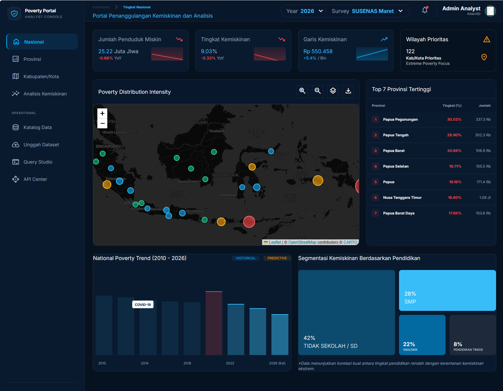
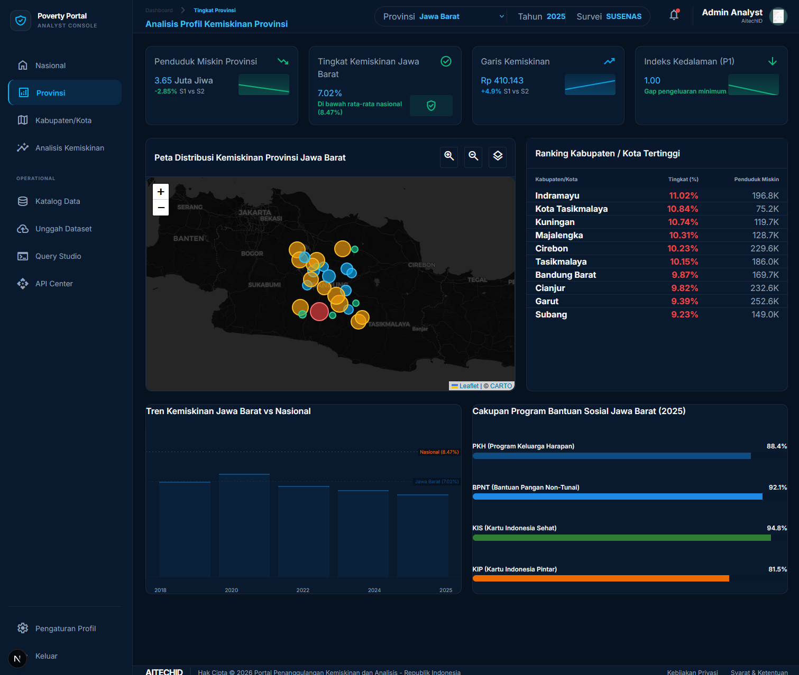
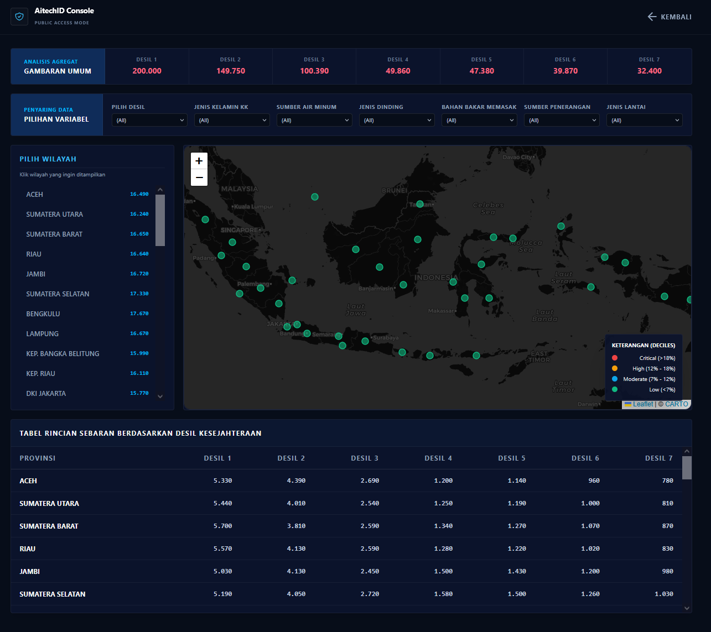

# 🏛️ Portal Penanggulangan Kemiskinan & Analisis Data BPS (AITECHID)

Portal Penanggulangan Kemiskinan adalah platform analisis data spasial dan kuantitatif terintegrasi yang dirancang untuk mendukung pengambilan keputusan kebijakan sosial secara presisi. Platform ini memetakan, menganalisis, dan mengeksplorasi data **Data Terpadu** nasional yang dinamis serta data kemiskinan makro dari Badan Pusat Statistik (BPS).

🌐 **Demo Aplikasi**: Untuk melihat demo aplikasi secara langsung, silakan mengunjungi halaman: [https://povdemo.aitech.id](https://povdemo.aitech.id)

---

## 🎥 Video Panduan & Demo Aplikasi

Silakan klik gambar di bawah ini untuk menonton demonstrasi penggunaan aplikasi langsung di YouTube:

[](https://www.youtube.com/watch?v=kJSkr-T9_qE)

---

## 📸 Tampilan Aplikasi

| 📊 Dashboard Nasional | 🗺️ Analisis Provinsi |
| :---: | :---: |
|  |  |

| 📍 Peta Sebaran Spasial |
| :---: |
|  |

---

## 🚀 Fitur Utama

Sistem ini dilengkapi dengan berbagai modul interaktif tingkat lanjut:

1. **Dashboard Nasional (`/national`)**:
   - Visualisasi tingkat kemiskinan makro, jumlah penduduk miskin, garis kemiskinan, dan jumlah wilayah prioritas ekstrem.
   - Peta spasial intensitas kemiskinan interaktif (Leaflet Map).
   - Daftar **Top 10 Provinsi Terpadat** dengan tingkat kemiskinan tertinggi dihitung dinamis dari data BPS.
   - Grafik historis & prediktif tren kemiskinan nasional serta grafik segmentasi tingkat pendidikan.

2. **Analisis Profil Provinsi (`/province`)**:
   - Analisis mendalam profil kemiskinan tingkat provinsi dengan dropdown reaktif (38 Provinsi Indonesia).
   - **Peta Spasial Provinsi Dinamis**: Menggeser *viewport* Leaflet secara otomatis dan merender sebaran pin kabupaten/kota menggunakan *hashing koordinat* stabil.
   - Tabel peringkat kemiskinan kabupaten/kota, grafik tren historis lokal vs nasional, dan cakupan program bantuan sosial (PKH, BPNT, KIS, KIP).

3. **Analisis Kabupaten/Kota (`/district`)**:
   - Dropdown bertingkat (*nested dropdown*) untuk memilih Provinsi dan Kabupaten/Kota terkait.
   - Visualisasi KPI tingkat kemiskinan, jumlah penduduk miskin, garis kemiskinan, indeks kedalaman (P1), serta kontribusi kemiskinan perkotaan vs perdesaan secara dinamis.

4. **Katalog & Pengunduhan Dataset (`/catalog`)**:
   - Manajemen katalog file database (`.db`, `.sqlite`) dan dokumen pendukung (`.csv`, `.xlsx`, `.pdf`, `.json`, `.docx`, dll.) secara dinamis.
   - Deteksi otomatis metadata berkas (nama berkas, ukuran, waktu modifikasi, deskripsi/caption kustom, skema tabel, dan jumlah baris).
   - Tombol **Download File** langsung untuk mengunduh dataset, serta tombol **Hapus File** reaktif dengan konfirmasi aman.
   - Tombol modal skema tabel interaktif khusus untuk file database SQLite.

5. **Unggah Dataset Multi-Format (`/upload`)**:
   - Modul unggah file (*drag & drop* atau *file browser*) yang mendukung banyak ekstensi dokumen.
   - Form deskripsi kustom yang akan diindeks sebagai caption deskripsi dataset di halaman Katalog.
   - Indeksasi otomatis skema database SQLite baru ke dalam server registry (`databases.json`).

6. **Poverty Analytics Engine (`/poverty-analysis`)**:
   - Visualisasi chart interaktif berbasis filter tahun, wilayah pembanding, dan indikator utama.
   - Grafik batang (Bar Chart) dan grafik garis (Line Chart SVG) dinamis yang bersumber langsung dari kueri agregasi database SQL riil.

7. **API Catalog Interaktif (`/api-catalog`)**:
   - Dokumentasi 7 endpoint API aktif lengkap dengan *expander box* untuk contoh request payload dan response JSON schema.

8. **Query Builder Lanjut (`/query-builder`)**:
   - Modul kueri SQL visual interaktif untuk melakukan filtering data rumah tangga (`household_pbdt`) dan individu (`individual_pbdt`).
   - Eksekusi instan di atas 50.000 data reaktif.

---

## 🛠️ Teknologi yang Digunakan

* **Core Framework**: [Next.js 15 App Router](https://nextjs.org/) (React 19, TypeScript)
* **Styling & UI**: Vanilla CSS & Tailwind CSS (desain premium bernuansa gelap-modern / *sleek dark mode*, glassmorphism, dan transisi mikro reaktif)
* **Peta Spasial**: [React Leaflet](https://react-leaflet.js.org/) & Leaflet.js
* **Mesin Database**: SQLite 3 (menggunakan modul sinkron berkecepatan tinggi `node:sqlite`)
* **Registrasi Dataset**: JSON Registry File (`databases.json`)

---

## 💻 Panduan Instalasi & Menjalankan Aplikasi

### Persyaratan Sistem
* **Node.js** v20.x atau lebih tinggi
* **NPM** v10.x atau lebih tinggi
* **Python** 3.x (hanya untuk script konversi/generasi opsional)

---

### 🟢 Instalasi di Sistem Operasi Windows

1. **Clone/Buka Folder Proyek**:
   Buka PowerShell atau Command Prompt pada folder workspace proyek Anda.
   ```powershell
   cd c:\Users\avudz\Kiro\Kemiskinan\poverty-portal
   ```

2. **Salin File Environment**:
   Salin atau buat file `.env` di direktori utama:
   ```powershell
   copy .env.example .env
   ```
   *Atau buat manual file `.env` dengan isi:*
   ```env
   NEXT_PUBLIC_APP_URL=http://localhost:3000
   ```

3. **Install Dependensi NPM**:
   ```powershell
   npm install
   ```

4. **Jalankan Development Server**:
   ```powershell
   npm run dev
   ```
   Buka browser dan akses halaman utama di [http://localhost:3000](http://localhost:3000).

---

### 🐧 Instalasi di Sistem Operasi Linux (Ubuntu/Debian/CentOS)

1. **Persiapan Node.js & NPM**:
   Pastikan Node.js terinstall. Jika belum:
   ```bash
   curl -fsSL https://deb.nodesource.com/setup_20.x | sudo -E bash -
   sudo apt-get install -y nodejs
   ```

2. **Buka Direktori Proyek**:
   ```bash
   cd /path/to/Kemiskinan/poverty-portal
   ```

3. **Buat File Environment**:
   ```bash
   echo "NEXT_PUBLIC_APP_URL=http://localhost:3000" > .env
   ```

4. **Install Dependensi & Jalankan Aplikasi**:
   ```bash
   npm install
   npm run dev
   ```
   Aplikasi akan berjalan di port `3000`. Jika dijalankan di VPS, pastikan port `3000` telah dibuka pada konfigurasi firewall Anda (`ufw allow 3000`).

---

## 🔌 Informasi API (Application Programming Interface)

Platform ini mengekspos 7 endpoint utama yang terdokumentasi di `/api-catalog`:

1. **`POST /api/query`**
   - **Fungsi**: Mengeksekusi filter SQL dinamis pada database `aitech.db`.
   - **Request Payload**:
     ```json
     {
       "dataset": "household",
       "deciles": [1, 2],
       "conditions": [{"column": "h_listrikflag", "operator": "=", "value": "1"}]
     }
     ```

2. **`GET /api/query/metadata`**
   - **Fungsi**: Mendapatkan nama kolom dan label metadata dataset (`?dataset=household` atau `?dataset=individual`).

3. **`GET /api/catalog`**
   - **Fungsi**: Mengambil data seluruh dataset & berkas dokumen terindeks.

4. **`DELETE /api/catalog`**
   - **Fungsi**: Menghapus file dataset fisik berdasarkan ID kueri (`?id=nama_id`).

5. **`POST /api/upload`**
   - **Fungsi**: Mengunggah file dataset baru dengan input multipart form data (`file` dan `description`).

6. **`GET /api/download`**
   - **Fungsi**: Mengunduh berkas mentah dari folder `aitech` (`?id=nama_id`).

7. **`GET /api/sebaran`**
   - **Fungsi**: Mengambil hasil kueri spasial terfilter untuk Leaflet Map nasional 38 provinsi.

---

## 🏛️ Penataan Struktur File Proyek

```text
├── aitech/                 # Folder penyimpanan fisik database (aitech.db & databases.json)
├── poverty-portal/
│   ├── public/             # Berkas statis (data JSON, ikon SVG)
│   ├── scripts/            # Script konversi data makro BPS ke JSON
│   ├── src/
│   │   ├── app/            # Next.js App Router (Routing, API, & Halaman Page)
│   │   ├── components/     # Komponen React reusable (Sidebar, Peta Spasial, dll.)
│   ├── .env                # Konfigurasi Environment URL Lokal
```

---

## 📘 Rencana Migrasi Produksi (Production Migration Plan)

Panduan langkah-demi-langkah mengenai deployment runtime Node.js, auto-start daemon PM2, Nginx SSL Reverse Proxy, dan kebijakan cron auto-backup harian dapat diakses pada tautan berikut:
* [production_migration_plan.md](file:///production_migration_plan.md)

---
*jika membutuhkan fitur lainnya atau kustomisasi lebih lanjut, kontak developer info (@) aitech dot id*


